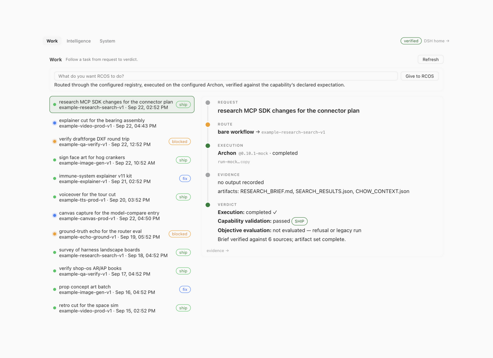
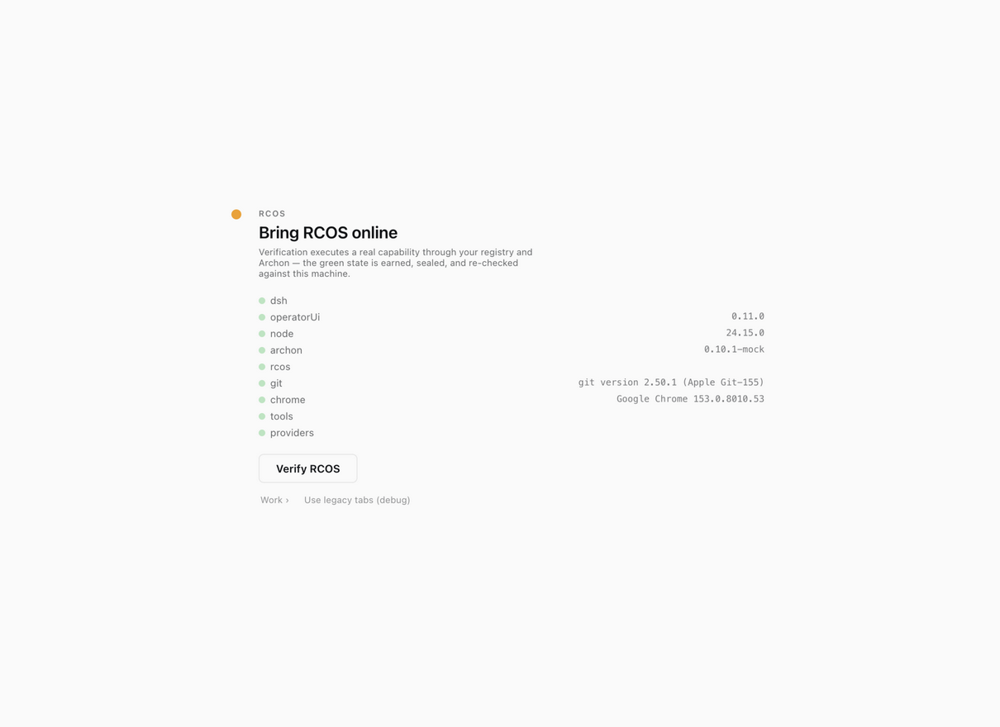
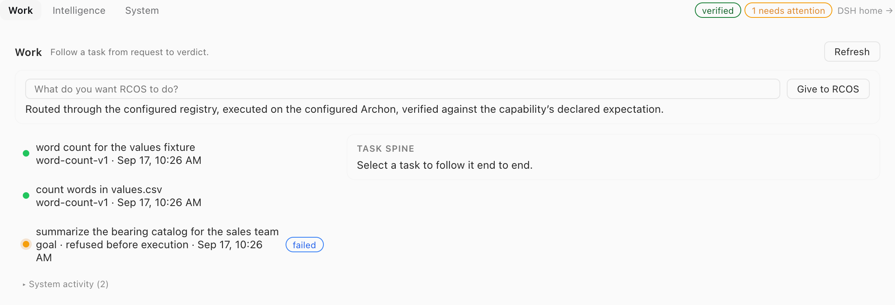
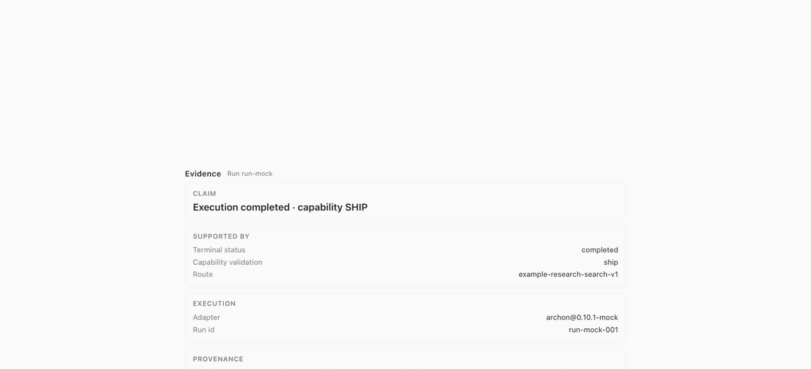
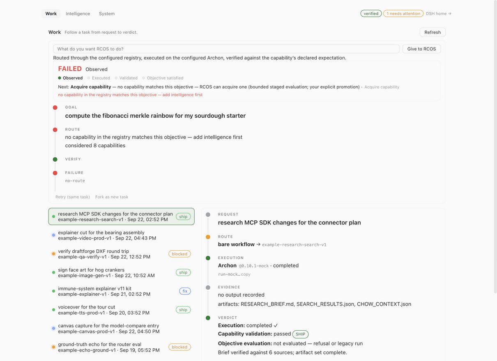
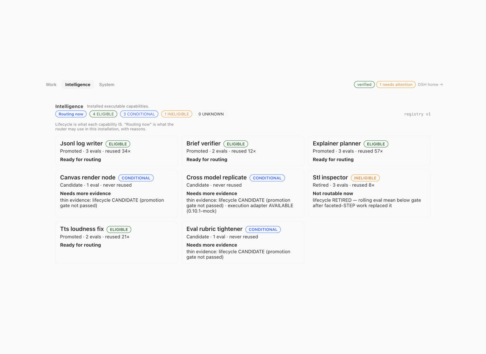
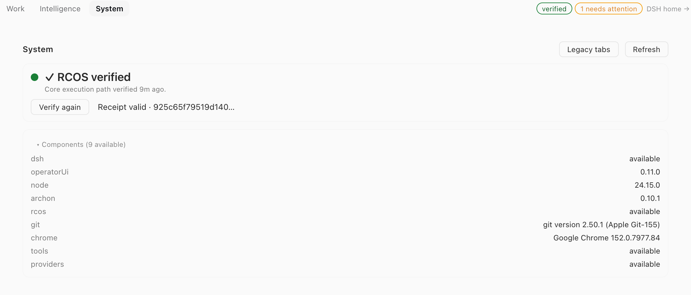

# dsh-operator-ui

An operator console for the [RCOS](https://github.com/Foshowithit/rcos) capability loop, side-loaded into [DeepSeek Harness](https://github.com/deepseek-ai/DeepSeek-Harness) (DSH)'s existing web UI. It adds a first-run **receipt gate**, a **Work** surface that follows a task from request to verdict, an **Intelligence** inventory of what the installation can actually execute, and a **System** panel — and it keeps the older panel tabs (Runs, Summary, Git, Browser, Files, Workflows, Capabilities) and a **⌘K command palette**. Nothing is a fork; every surface reads authoritative state and none replaces shipped UI.



> **Also in this repository: [FlowRouter](./FLOWROUTER.md)** — a sealed
> federation layer for capability artifacts that transports *evidence* of trust,
> never trust itself. Repositories, mirrors, discovery indexes and sync
> schedulers are all assumed untrusted. Start with
> [`FLOWROUTER.md`](./FLOWROUTER.md); the evidence is fourteen raw receipts in
> [`eval/receipts/`](./eval/receipts/) and `node eval/lib/flowrouter-show.mjs`
> prints the end-to-end trace in five minutes.

It is a side-loaded DSH plugin (a Cordis bundle patch), not a fork:

- **No upstream changes.** One package, installed into a profile; removing it restores stock DSH exactly.
- **No duplicate state.** Every rendered fact is authoritative Host state, read through the services the web profile already mounts (`ctx.sessions` list + projections + jobs) plus the Archon API and the capability registry. Nothing is polled from the renderer, nothing is inferred from chat text, and the plugin persists nothing of its own.
- **Additive seats.** It registers into the `conversation.view` list beside Conversation and Trajectory and into the shell's overlay slot. It never replaces shipped UI, and an installation that prefers the old tabs can stay on them.

## The RCOS control surface

On an installation that has not yet earned its receipt, the whole UI is the gate:



**The gate** checks nine components (DSH, operator-ui, Node, Archon, RCOS, git, Chrome, tools, providers) and offers **Verify RCOS** — which executes a real capability through *your* registry and *your* Archon, then seals the result into `<home>/operator-ui/receipt.json`. The green state is earned, not asserted: the receipt is re-read and re-checked on every load (VALID / STALE / TAMPERED / NONE), so a stale or tampered receipt puts the gate back. **Work ›** unlocks only behind a valid receipt; **Use legacy tabs (debug)** is the escape hatch.

**Work** is the operator loop. Type an objective, hand it to RCOS, and the task is routed through the configured registry, executed on the configured Archon, and verified against the capability's declared expectation:



Select a task and you get its spine — REQUEST → ROUTE → EXECUTION → EVIDENCE → VERDICT — with the dots (Observed / Executed / Validated / Objective satisfied) as the at-a-glance state, the authority line ("Ask before acting"), and the next step spelled out. From there, **evidence →** opens the drawer a reviewer would ask for:



Nothing is dressed up. A goal the installation cannot route is refused **before** execution — no Archon run, no fabricated evidence, spine columns reading "— (refused before execution)", verdict `FAILED · no-route` — and the surface offers bounded acquisition instead of pretending:



**Intelligence** answers "what can this installation actually execute?" Lifecycle is what a capability *is*; routing is what the router may use *right now*, with reasons:



**System** is the receipt and the machine: verification state and age, the receipt hash, the component inventory with versions, **Verify again**, and the switch to the legacy tabs.



Every screenshot above comes from a sanitized demo home — one promoted capability (`word-count 1.0.0 → workflow word-count-v1`) executing over a scratch workspace. No real workspace data, paths or session titles.

## The legacy tabs

The older panel set is still registered and unchanged; **System → Legacy tabs** (or the gate's debug button) is the way back to it:

| Tab | What it shows |
|---|---|
| **Runs** | one row per session: status dot (running / needs-attention / done / idle / blank), title + preset + cwd, last update, context-pressure meter (warns ≥80%, critical ≥95%), session token total, badges for live background jobs and pending inbox input. Click a row for the detail pane — session facts, the live inbox (queued vs steering placements), running tool calls, background jobs, **Open** and **Cancel turn**. |
| **Summary** | the one-screen answer to "what is this run doing": state, last output, turns/steps/LLM time, context pressure, in-flight work, branch + changes |
| **Git** | read-only workspace status / diff / log with staged-unstaged-untracked chips |
| **Browser** | a supervised on-screen browser the agent drives while you watch every action live |
| **Files** | workspace tree with git M/A/D badges and inline text-file preview |
| **Workflows** | Archon runs — status, step, ship/fix/blocked |
| **Capabilities** | registry view — promoted/candidate/retired, gate progress, reuse counts, eval history |
| **Work**, **Intelligence**, **System** | the same three RCOS control-plane surfaces the gate opens, rendered in-session |

The **⌘K / Ctrl+K command palette** works from anywhere, including inside the composer (jump to any session, new session, toggle sidebar, switch views). Point `DSH_OPERATOR_UI_ARCHON` at the Archon API and `DSH_OPERATOR_UI_REGISTRY` at your `capability-registry.json` (schema: [capability-registry.schema.json](https://github.com/Foshowithit/rcos/blob/main/prototype/capability-registry.schema.json)) — see DEPLOY.md.

## Install

Requires DSH `0.1.0-rc.6` and an Archon `0.10.1`-shaped workflow API (the
versions this was built and verified against — see COMPAT.md for the full
tested pin: DSH + plugin + peers + Archon, each with its source of truth).

### Requirements

- **Platform:** macOS or Linux. Windows is explicitly unsupported (the plugin
  uses POSIX path rules and `pkill`/`pgrep` for the supervised browser).
- **Node:** ≥ 22 (`engines` enforced; the Browser tab uses Node's native WebSocket).
- **git** on PATH (read-only usage, Git/Files tabs).
- **DSH** `0.1.0-rc.6` with the `web` profile in use.
- **Archon** `0.10.1` at the configured endpoint (default
  `http://127.0.0.1:3090`, the local `archon serve` port). Migrated workflows
  need the `env@1` transport — see Compatibility notes.
- **Optional:** Chrome/Chromium on the host (Browser tab human-driving works
  without it only if a binary is found; override with `DSH_OPERATOR_UI_CHROME`).
- **Optional:** Python 3 (only for RCOS registry schema checks, later slices).
- **Optional:** `@deepseek-ai/dsh-tools` peer — enables the four `browser_*`
  agent tools. Without it the plugin still boots and serves every tab; the
  Browser tab says honestly that agent driving is disabled (human driving
  still works). Real installs resolve peers automatically; the `link:` dev
  setup needs the peer installed beside DSH (see AGENTS.md).

From a clone of this repository:

```sh
git clone https://github.com/Foshowithit/dsh-operator-ui.git
cd dsh-operator-ui
node scripts/check.js                 # must PASS before proceeding
dsh plugin --profile web add "$PWD"
```

No manual `cordis.patch.yml` edit is needed — the plugin's bundle patch self-inserts its row (`- insert:` form).

**Then restart the web profile completely** — stop the process running the
`web` profile and start it again (DEPLOY.md shows the systemd unit form).
This is required after every install and upgrade, not a suggestion: the host
half (`lib/`) is imported once at boot into the module cache and the client
bundle's `?rev=` cache-buster is fixed at boot, so a live-reload does not pick
up the new plugin half — only a full restart puts it in front of browsers
(this is a tested contract fact in COMPAT.md). On a machine with no valid
receipt you land on the gate; verify once and you get the RCOS surfaces above,
with the legacy tabs one click away.

### A clean installation vs. this repository's own deployment

Nothing that ships points at the maintainer's machines. On a clean install:

- **Archon** defaults to `http://127.0.0.1:3090` — the local endpoint a stock
  `archon serve` listens on. It is a documented local default; this repository
  packages no address of any other host.
- **Registry** starts unconfigured (`registry.path: ""`) — you supply your own
  `capability-registry.json` path via the config file or env vars (DEPLOY.md).
- **No secrets** ship: `archon.tokenVar` names an env var (presence only,
  never the value) and provider credentials stay in their own stores.

To point at a different Archon (remote, token-protected, non-default port),
copy `fixtures/operator-ui.config.example.json` to
`$DSH_HOME/operator-ui.config.json` and edit it, or override through env.
This repository's own development deployment is exactly that shape — DSH on
one machine, Archon on a second machine over a private network — configured
only in the maintainer's out-of-repo `$DSH_HOME/operator-ui.config.json` and
never packaged. `node scripts/check.js` enforces the boundary: it fails on
private machine/ecosystem names or user home paths in any tracked file, and on
tailnet addresses anywhere outside the historical `eval/` evidence receipts
(two-machine receipts that are not part of the distributable — the `package.json`
`files` list ships only `lib/`, `cordis.patch.yml`, `README.md`, `LICENSE`).

### When no executable capabilities are installed

The surfaces stay honest instead of pretending to work:

- **Registry not configured** — Work refuses every objective *before*
  execution with `registry not configured — set registry.path`
  (`registry-not-configured`); no run is dispatched, nothing is fabricated.
- **Registry configured, nothing matches** — the goal is refused before
  execution: the spine reads `— (refused before execution)`, the verdict is
  `FAILED · no-route`, and the surface offers a bounded **Acquire capability**
  step instead of a fake attempt (screenshot above).
- **Intelligence** reports the truth: `No capabilities installed — add
  intelligence to give RCOS more to do.`

## Uninstall / disable

```sh
dsh plugin --profile web remove dsh-operator-ui
```

Slot entries, the style tag, and the host-half service are all fiber-owned effects — removing the plugin reverts everything. Sessions, settings and the receipt are untouched (the plugin never writes sessions or settings).

## Compatibility notes

- Verified against DSH `0.1.0-rc.6` (Cordis 4.x, web profile) with the Archon `0.10.1` API shape. The client half targets the `conversation.view` slot contract as served by that version.
- **`env@1` requirement.** Workflows migrated into this repository use the `env@1` transport: they run only on an Archon whose loader admits a literal `env@1` (the verified `0.10.1` build on the tested pin), and admission fails closed on anything else. The patched CSV workflow is therefore **not** claimed to run on every stock Archon installation — check your Archon's loader before expecting migrated workflows to schedule.
- **COMPAT.md is the tested pin** — RCOS owns the exact known-good DSH + plugin + Archon combination; upgrades move through verification before the pin changes. The `peerDependencies` range in `package.json` stays truthful but is not the support claim.
- Styling is scoped under `.opui-*` classes and keyed off DSH design tokens (`--dsw-*`) with fallbacks — it does not depend on build-specific CSS-module hashes.
- Unknown projection fields degrade to blanks, never crashes: the surfaces guard every field they read.

## Security disclosures

Two known issues are published deliberately:

1. **Legacy source-splicing remains unsafe for arbitrary message content.**
   The legacy path that splices source/context material directly into messages
   must not carry content you do not control — anything spliced in can be
   interpreted as instructions, and anything that reaches a shell can be
   interpreted by the shell. Routing through the registry-routed Work path is
   **not** by itself protection from unsafe shell substitution: safety depends
   on the selected workflow and its actual argument-transport contract —
   whether values travel as structured arguments rather than being spliced
   into a command line. Read that workflow's transport contract before
   trusting it with untrusted content.
2. **Archon persists dispatch messages.** Anything dispatched to Archon — goal
   text, payloads, conversation material — is durably stored by Archon (runs,
   logs, artifacts). Retention is Archon's behavior, not this plugin's; do not
   dispatch secrets or personal data expecting ephemerality.

## Layout

```
lib/index.js    host half  — status route, config, verification, registry + Archon reads
lib/client.js   client half — gate, Work, Intelligence, System, legacy tabs, palette
cordis.patch.yml bundle patch — one self-insert row
```

## License

MIT
