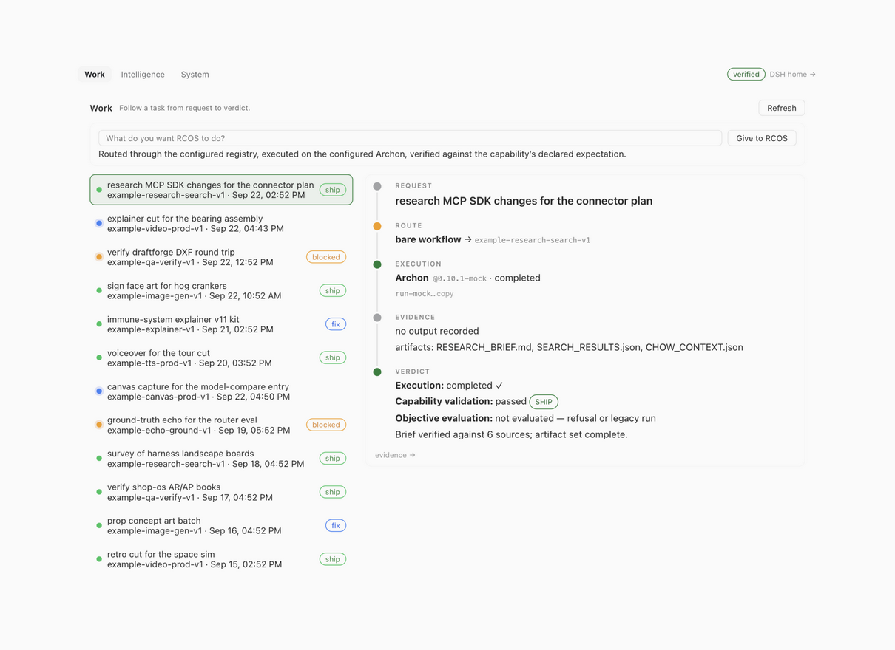
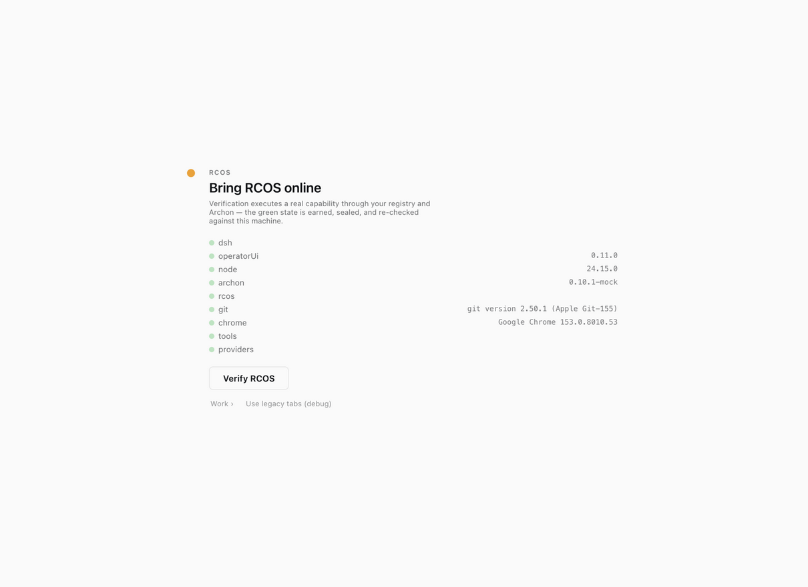
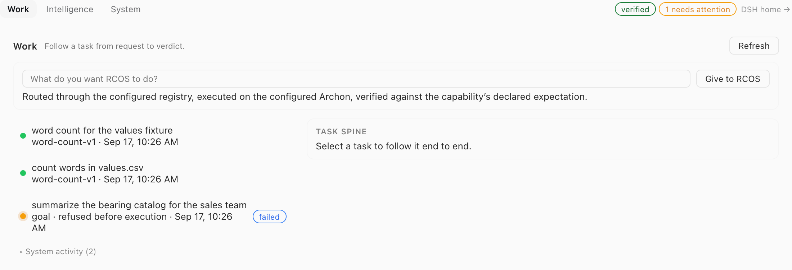
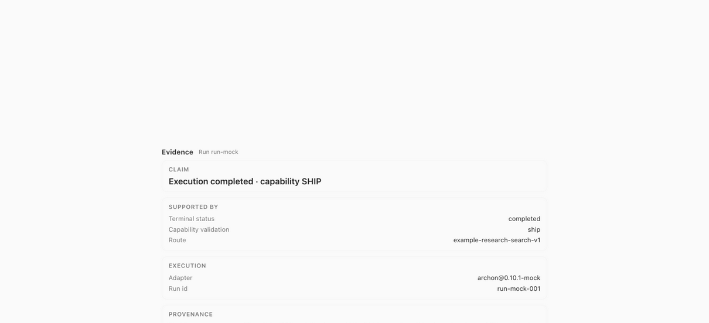
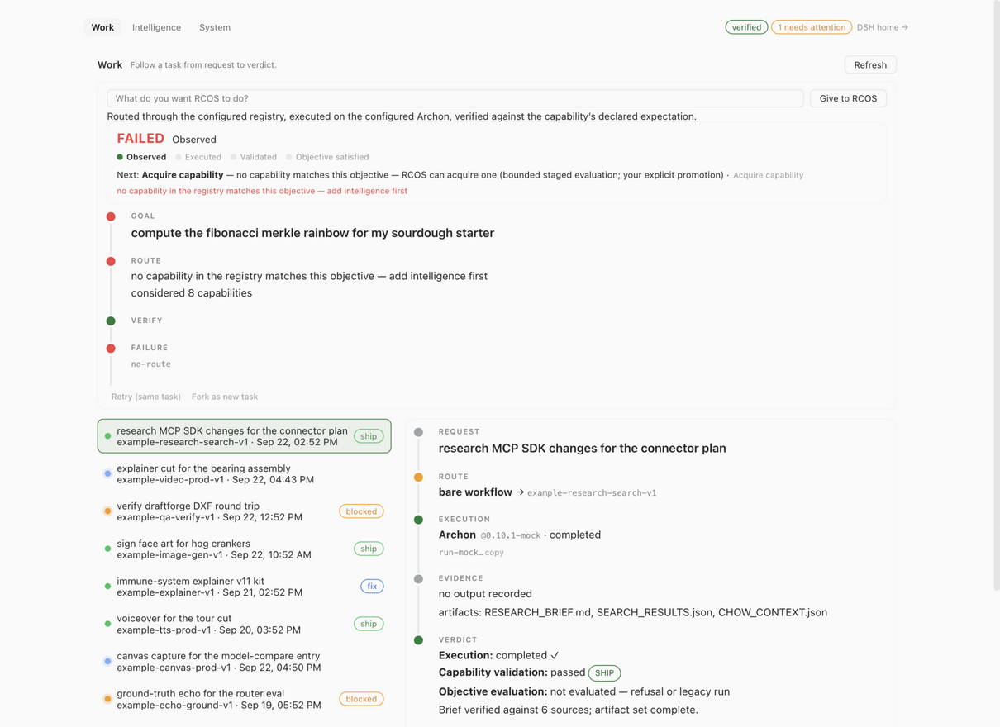
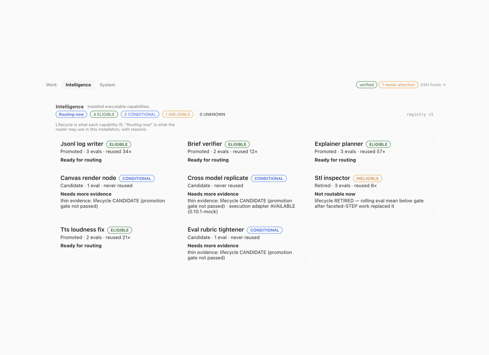
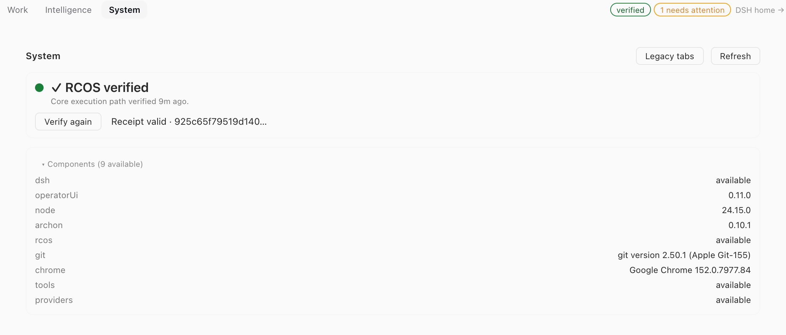

# dsh-operator-ui

[](https://github.com/Foshowithit/dsh-operator-ui/actions/workflows/host-boot-smoke.yml)

The public operator/integration surface for RCOS (Recursive Capability Operating System) on DeepSeek Harness. The repository contains the established side-loaded DSH web package and tracks the newer native Desktop integration, which is now the primary RCOS operator-seat direction. It adds governed Work, Intelligence and System surfaces plus execution/evidence/receipt visibility without turning DSH into the RCOS kernel. Nothing is a fork; RCOS remains portable across seats.

## Start here: Desktop is the primary RCOS seat

**DeepSeek Desktop integration is working in current RCOS development and is
the primary daily operator-seat direction.** RCOS remains a separate control
plane: Desktop provides the shell/session experience; RCOS provides routing,
capability selection, governed execution, evidence, evaluation and receipts.

The public `main` branch still contains the older, fully documented DSH web
profile package. Its tested public pin is DSH `0.1.0-rc.6` with an Archon
`0.10.1`-shaped API, installed through the locked host in
[`host/`](host/README.md). **Do not read that older web pin as the current
product direction.**

The newer Desktop path has working native integration in development, including
the RCOS operator surfaces, General/Idea → Workflow Manager dispatch, bounded
tool authority, session-bound execution activity, Canvas/artifact surfaces and
receipt-gated handoff. The public repository does **not yet contain the complete
newer Desktop source/configuration needed to reproduce that installation from a
fresh clone**, so we are not labeling it a one-command public release until
those exact files and install steps are published and re-verified.

See [docs/DESKTOP.md](docs/DESKTOP.md) for the current Desktop status and the
publication boundary.

- **Using the current public package:** read [Requirements](#requirements),
  [Install](#install), then [DEPLOY.md](DEPLOY.md) for the verified web-profile
  setup.
- **Following Desktop:** treat Desktop as the primary RCOS seat and
  [docs/DESKTOP.md](docs/DESKTOP.md) as the status page. Do not apply the old
  web-profile commands to an existing Desktop profile.
- **Understand the evidence boundary:** an installed UI alone does not prove a
  working execution environment. RCOS claims are gated by executed evidence and
  receipts.
- **Looking for the RCOS source repository?** It is currently private while the
  canonical source is reconciled for publication. This repository remains the
  public operator/integration surface.



> **Also in this repository: [FlowRouter](./FLOWROUTER.md)** — a sealed
> federation layer for capability artifacts that transports *evidence* of trust,
> never trust itself. Repositories, mirrors, discovery indexes and sync
> schedulers are all assumed untrusted. Start with
> [`FLOWROUTER.md`](./FLOWROUTER.md); the evidence is fourteen raw receipts in
> [`eval/receipts/`](./eval/receipts/) and `node eval/lib/flowrouter-show.mjs`
> prints the end-to-end trace in five minutes.

It is a side-loaded DSH plugin (a Cordis bundle patch), not a fork:

- **No upstream changes.** One package, installed into a profile; removing it restores stock DSH exactly.
- **No duplicate state.** Every rendered fact is authoritative Host state, read through the services the web profile already mounts (`ctx.sessions` list + projections + jobs) plus the Archon API and the capability registry. Nothing is polled from the renderer and nothing is inferred from chat text; the plugin's own durable state is limited to named files under the active `DSH_HOME` — the task store at `operator-ui/tasks.json`, the sealed `operator-ui/receipt.json`, and teaching workflow/eval paths only where configured.
- **Additive seats.** It registers into the `conversation.view` list beside Conversation and Trajectory and into the shell's overlay slot. It never replaces shipped UI, and an installation that prefers the old tabs can stay on them.

## The RCOS control surface

On an installation that has not yet earned its receipt, the whole UI is the gate:



**The gate** checks nine components (DSH, operator-ui, Node, Archon, RCOS, git, Chrome, tools, providers) and offers **Verify RCOS** — which executes a real capability through *your* registry and *your* Archon, then seals the result into `<home>/operator-ui/receipt.json`. The green state is earned, not asserted: the receipt is re-read and re-checked on every load (VALID / STALE / TAMPERED / NONE), so a stale or tampered receipt puts the gate back. **Work ›** unlocks only behind a valid receipt; **Use legacy tabs (debug)** is the escape hatch.

**Work** is the operator loop. Type an objective, hand it to RCOS, and the task is routed through the configured registry, executed on the configured Archon, and verified against the capability's declared expectation:



Select a task and you get its spine — REQUEST → ROUTE → EXECUTION → EVIDENCE → VERDICT — with the dots (Observed / Executed / Validated / Objective satisfied) as the at-a-glance state, the authority line ("Ask before acting"), and the next step spelled out. From there, **evidence →** opens the drawer a reviewer would ask for:



Nothing is dressed up. A goal the installation cannot route is refused **before** execution — no Archon run, no fabricated evidence, verdict `FAILED · no-route`, objective evaluation reported as `not evaluated — refusal or legacy run`, and a bounded **Acquire capability** offer instead of pretending:



**Intelligence** answers "what can this installation actually execute?" Lifecycle is what a capability *is*; routing is what the router may use *right now*, with reasons:



**System** is the receipt and the machine: verification state and age, the receipt hash, the component inventory with versions, **Verify again**, and the switch to the legacy tabs.



Every screenshot above comes from a sanitized fixture home — a demo capability registry of eight named capabilities, `example-*` workflows over a scratch workspace, and a mock Archon. No real workspace paths or credentials appear in these shots.

## The legacy tabs

The older panel set is still registered and unchanged; **System → Legacy tabs** (or the gate's debug button) is the way back to it:

| Tab | What it shows |
|---|---|
| **Runs** | one row per session: status dot (running / needs-attention / done / idle / blank), title + preset + cwd, last update, context-pressure meter (warns ≥80%, critical ≥95%), session token total, badges for live background jobs and pending inbox input. Click a row for the detail pane — session facts, the live inbox (queued vs steering placements), running tool calls, background jobs, **Open** and **Cancel turn**. |
| **Summary** | the one-screen answer to "what is this run doing": state, last output, turns/steps/LLM time, context pressure, in-flight work, branch + changes |
| **Git** | read-only workspace status / diff / log with staged-unstaged-untracked chips |
| **Browser** | a supervised on-screen browser the agent drives while you watch every action live |
| **Files** | workspace tree with git M/A/D badges and inline text-file preview |
| **Workflows** | Archon runs — status, step, ship/fix/blocked |
| **Capabilities** | registry view — promoted/candidate/retired, gate progress, reuse counts, eval history |
| **Work**, **Intelligence**, **System** | the same three RCOS control-plane surfaces the gate opens, rendered in-session |

The **⌘K / Ctrl+K command palette** works from anywhere, including inside the composer (jump to any session, new session, toggle sidebar, switch views). Point `DSH_OPERATOR_UI_ARCHON` at the Archon API and `DSH_OPERATOR_UI_REGISTRY` at your `capability-registry.json` (start with the [fixture registry](fixtures/capability-registry.example.json); the separate RCOS schema repository is currently private) — see DEPLOY.md.

## Install

Requires DSH `0.1.0-rc.6` installed through this repository's
[locked host](#locked-host-required), and an Archon `0.10.1`-shaped workflow API
(the versions this was built and verified against — see COMPAT.md for the full
tested pin: DSH + plugin + peers + Archon, each with its source of truth).

### Requirements

- **Platform:** macOS or Linux. Windows is explicitly unsupported (the plugin
  uses POSIX path rules and `pkill`/`pgrep` for the supervised browser).
- **Node:** ≥ 22 (`engines` enforced; the Browser tab uses Node's native WebSocket).
- **pnpm ≥ 10** on PATH. `dsh plugin` forwards to pnpm, so without it plugin
  installation cannot run at all (`dsh: pnpm not found on PATH`). **pnpm 9 will
  not work**: `dsh` marks the profile directory as a pnpm workspace root, and
  pnpm 9 refuses to install there without an explicit `-w`, failing with
  `ERR_PNPM_ADDING_TO_ROOT`. Measured 2026-09-30 — 9.15.9 fails; 10.34.6,
  11.28.2 and 12.8.1 pass. `corepack enable pnpm` is enough, but check the
  version it resolves.
- **git** on PATH (read-only usage, Git/Files tabs).
- **DSH** `0.1.0-rc.6` with the `web` profile in use — installed through
  **[this repository's locked host](#locked-host-required)**, not a bare
  `npx`. A fresh install resolves a drifted Cordis stack and will not boot; see
  below and COMPAT.md.
- **Archon** `0.10.1` at the configured endpoint (default
  `http://127.0.0.1:3090`, the local `archon serve` port). Migrated workflows
  need the `env@1` transport — see Compatibility notes.
- **Optional:** Chrome/Chromium on the host (Browser tab human-driving works
  without it only if a binary is found; override with `DSH_OPERATOR_UI_CHROME`).
- **Optional:** Python 3 (only for RCOS registry schema checks, later slices).
- **Optional:** `@deepseek-ai/dsh-tools` peer — enables the four `browser_*`
  agent tools. Without it the plugin still boots and serves every tab; the
  Browser tab says honestly that agent driving is disabled (human driving
  still works). Real installs resolve peers automatically; the `link:` dev
  setup needs the peer installed beside DSH (see AGENTS.md).

The supported setup below uses a **Git clone**. Installing the plugin adds the
UI; running RCOS tasks also requires a reachable compatible Archon, a configured
registry with executable workflows, and an Archon workspace. Follow
[the seeded verification steps](DEPLOY.md#verify-seeded-zero-credential) to check
that connection. A local self-check is not an executed RCOS task.

### Locked host (required)

`@deepseek-ai/dsh@0.1.0-rc.6` declares **floating caret ranges** on its Cordis
stack. Install it today without a lock and you get Cordis `4.0.4` /
`cordis-plugin-hmr` `1.0.19`, and the host dies at boot with:

```text
dsh: user patch-layer watching requires the Cordis HMR service
```

That is dependency drift, not a misconfiguration, and it is why a bare
`npx @deepseek-ai/dsh@0.1.0-rc.6 web` is not a supported starting point.
`host/` carries the pin as npm `overrides` plus a lockfile:

```sh
git clone https://github.com/Foshowithit/dsh-operator-ui.git
cd dsh-operator-ui
npm install --prefix host                         # locked DSH host (Cordis 4.0.2 pin)
node scripts/boot-smoke.mjs                       # must PASS: real boot, real HTTP 200
export PATH="$PWD/host/node_modules/.bin:$PATH"   # `dsh` now resolves to the locked host
node scripts/check.js                             # must PASS before proceeding
dsh plugin --profile web add "$PWD"
```

`npm install --prefix host` is not optional and is not interchangeable with an
`npm install` at the repository root — the root package *is the plugin*, the
`host/` package is *the host it runs inside*. The first run writes
`host/package-lock.json`; commit it, and later installs can use
`npm ci --prefix host`. COMPAT.md records the exact pinned set, the measured A/B
that established it, and the upgrade policy.

No manual `cordis.patch.yml` edit is needed — the plugin's bundle patch self-inserts its row (`- insert:` form).

**Then restart the web profile completely** — stop the process running the
`web` profile and start it again (DEPLOY.md shows the systemd unit form).
This is required after every install and upgrade, not a suggestion: the host
half (`lib/`) is imported once at boot into the module cache and the client
bundle's `?rev=` cache-buster is fixed at boot, so a live-reload does not pick
up the new plugin half — only a full restart puts it in front of browsers
(this is a tested contract fact in COMPAT.md). On a machine with no valid
receipt you land on the gate; verify once and you get the RCOS surfaces above,
with the legacy tabs one click away.

### A clean installation vs. this repository's own deployment

Nothing that ships points at the maintainer's machines. On a clean install:

- **Archon** defaults to `http://127.0.0.1:3090` — the local endpoint a stock
  `archon serve` listens on. It is a documented local default; this repository
  packages no address of any other host.
- **Registry** starts unconfigured (`registry.path: ""`) — you supply your own
  `capability-registry.json` path via the config file or env vars (DEPLOY.md).
- **No secrets** ship: `archon.tokenVar` names an env var (presence only,
  never the value) and provider credentials stay in their own stores.

To point at a different Archon (remote, token-protected, non-default port),
copy `fixtures/operator-ui.config.example.json` to
`$DSH_HOME/operator-ui.config.json` and edit it, or override through env.
This repository's own development deployment is exactly that shape — DSH on
one machine, Archon on a second machine over a private network — configured
only in the maintainer's out-of-repo `$DSH_HOME/operator-ui.config.json` and
never packaged. `node scripts/check.js` enforces the boundary: it fails on
private machine/ecosystem names or user home paths in any tracked file, and on
tailnet addresses anywhere outside the historical `eval/` evidence receipts
(two-machine receipts that are not part of the distributable — the `package.json`
`files` list ships runtime code, the manifest and verification fixtures,
`cordis.patch.yml`, `README.md`, and `LICENSE`).

### When no executable capabilities are installed

The surfaces stay honest instead of pretending to work:

- **Registry not configured** — Work refuses every objective *before*
  execution with `registry not configured — set registry.path`
  (`registry-not-configured`); no run is dispatched, nothing is fabricated.
- **Registry configured, nothing matches** — the goal is refused before
  execution: the verdict is `FAILED · no-route`, the objective evaluation
  reads `not evaluated — refusal or legacy run`, and the surface offers a
  bounded **Acquire capability** step instead of a fake attempt (screenshot
  above).
- **Intelligence** reports the truth: `No capabilities installed — add
  intelligence to give RCOS more to do.`

## Uninstall / disable

```sh
dsh plugin --profile web remove dsh-operator-ui
```

Slot entries, the style tag, and the host-half service are all fiber-owned effects — removing the plugin reverts everything. Sessions, settings and the receipt are untouched (the plugin never writes sessions or settings).

## Compatibility notes

- Verified against DSH `0.1.0-rc.6` (Cordis 4.x, web profile) with the Archon `0.10.1` API shape. The client half targets the `conversation.view` slot contract as served by that version.
- **`env@1` requirement.** Workflows migrated into this repository use the `env@1` transport: they run only on an Archon whose loader admits a literal `env@1` (the verified `0.10.1` build on the tested pin), and admission fails closed on anything else. The patched CSV workflow is therefore **not** claimed to run on every stock Archon installation — check your Archon's loader before expecting migrated workflows to schedule.
- **COMPAT.md is the tested pin** — RCOS owns the exact known-good DSH + plugin + Archon combination; upgrades move through verification before the pin changes. The `peerDependencies` range in `package.json` stays truthful but is not the support claim.
- Styling is scoped under `.opui-*` classes and keyed off DSH design tokens (`--dsw-*`) with fallbacks — it does not depend on build-specific CSS-module hashes.
- Unknown projection fields degrade to blanks, never crashes: the surfaces guard every field they read.

## Security disclosures

Two known issues are published deliberately:

1. **Legacy source-splicing remains unsafe for arbitrary message content.**
   The legacy path that splices source/context material directly into messages
   must not carry content you do not control — anything spliced in can be
   interpreted as instructions, and anything that reaches a shell can be
   interpreted by the shell. Routing through the registry-routed Work path is
   **not** by itself protection from unsafe shell substitution: safety depends
   on the selected workflow and its actual argument-transport contract —
   whether values travel as structured arguments rather than being spliced
   into a command line. Read that workflow's transport contract before
   trusting it with untrusted content.
2. **Archon persists dispatch messages.** Anything dispatched to Archon — goal
   text, payloads, conversation material — is durably stored by Archon (runs,
   logs, artifacts). Retention is Archon's behavior, not this plugin's; do not
   dispatch secrets or personal data expecting ephemerality.

## Layout

```
lib/            24 modules — index.js boots the host half (status route,
                config, verification, registry + Archon reads); client.js is
                the client half (gate, Work, Intelligence, System, legacy
                tabs, palette); the rest cover the durable task store,
                evidence/authority, teaching, FlowRouter/federation,
                history/status/sync, the supervised browser, and
                config/discovery
cordis.patch.yml bundle patch — one self-insert row
```

## License

MIT
