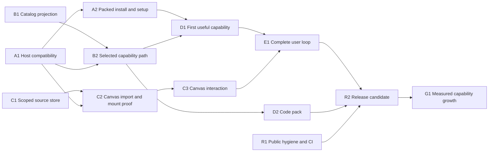

# Public Desktop Release Implementation Plan

> **For agentic workers:** Use `superpowers:subagent-driven-development` or
> `superpowers:executing-plans` to implement one claimed packet at a time.
> The user selected Luna workers with independent review. Do not restart planning
> or ask for the execution method again. Checkboxes below are acceptance work,
> not claims of completion.

**Goal:** Release a public, installable DSH-based agent workspace with a useful
capability library, Open Canvas inspection, and independently reviewable results.

**Architecture:** Keep this repository as the product home and DSH as an upstream
runtime dependency. Extend existing task, execution, registry and approval
authorities. Add read models and scoped Canvas views without another control plane.

**Tech Stack:** Existing Node >=22 ESM host, Cordis integration, React through
DSH's ModuleLoader, Node test runner, existing Archon/RCOS contracts. Canvas
TypeScript/TSX donor import and browser build mechanics require packet C2 first;
no new build stack is assumed by this plan.

**Spec:** [Public Desktop roadmap](../../PUBLIC-DESKTOP-ROADMAP.md),
[product home](../../../DESKTOP.md), and
[Canvas seam reconnaissance](../../CANVAS-DSH-SEAM-RECON.md).

## Global constraints

- Work from `rcos-dsh-reconcile`; the baseline readiness code is `4a4cb1a`.
- Keep one team per worktree. Integrator owns shared entrypoints and commits.
- Use additive DSH slots; preserve native chat, tabs, file callbacks and sessions.
- Existing stores and registry authority remain unchanged. New read models are
  ephemeral; new routes, polling or stores need a separately reviewed contract.
- Closed PanelDoc vocabulary: twelve primitives. Trusted approval UI stays host-owned.
- No identity inference from parent/task IDs. DSH calls, sessions and Archon runs
  have distinct types; exact settled identities do not imply live worker state.
- Never infer execution, progress, verification or success from absent data.
- No live install/profile/provider/service changes, push, publication, registry
  promotion, heavy jobs or production dispatch in this development plan.
- Bounded fixtures and source tests are allowed. A real runtime acceptance run
  requires a disposable profile, a reviewed command/runbook and available scope.
- Use explicit capability selection or supported model-assisted selection. Do not
  grow the legacy lexical matcher into a universal deterministic router.
- Runtime support claims require recorded evidence for the exact host/package.

## Review focus

1. Duplicate/colliding IDs and stale responses after a workspace/session switch:
   B1 and C1 must refuse or discard them without exposing another context's data.
2. Registry contents change between selection and dispatch: B2 must reject a
   stale selection without falling back to another capability or workflow.
3. A receipt is valid but execution is missing, or an adapter exits successfully
   without valid evidence: A2 and D1 must keep execution/verification claims separate.
4. Install/upgrade/remove fails midway: A2 must preserve existing sessions and
   name what changed; recovery cannot silently point at the user's default profile.
5. Long or adversarial text inside a panel: C3 must remain bounded, keyboard-usable
   and inert; it cannot create a trusted badge, action, file read or source binding.

## Task graph and ownership

**Start now:** A1, B1 and C1 are independent. These are the only first-wave
implementation/design packets. R1 inventory-only work can replace a blocked
worker. Do not begin dependent runtime integration before its interfaces pass.

| Lane | Exclusive ownership | Shared edits submitted to integrator |
| --- | --- | --- |
| A: compatibility/release setup | `docs/DESKTOP-COMPATIBILITY.md`, A2 install tests and onboarding docs | `COMPAT.md`, `package.json`, `lib/compat.js`, `lib/cli.js`, config/manifest and root docs |
| B: catalog/selection | `lib/capability-view.js`, its tests, `docs/CAPABILITY-VIEW-CONTRACT.md` | `lib/goal.js`, `lib/admission.js`, `lib/index.js`, `lib/client.js` |
| C: Canvas | `lib/execution-source.js`, its tests, `docs/EXECUTION-SOURCE-CONTRACT.md`, reviewed Canvas files after C2 | `lib/client.js`, `lib/index.js`, package/build configuration |
| D: capability packs | One named `capabilities/<id>/` directory per worker and its focused tests | Bindings, registry fixtures and shared runtime integration |
| R: public release | New release/audit docs, new CI/test files | `.github/workflows/`, package metadata, root documentation |

`lib/client.js`, `lib/index.js`, `package.json`, `scripts/check.js`, `AGENTS.md`
and the queue always have one integrator writer. A worker proposes its small
integration patch after its isolated module/contract review; no concurrent edits.
See [the queue](../../AGENT-QUEUE.md) for claims and dependencies.

## Common execution and evidence protocol

- [ ] Read `AGENTS.md`, `DESKTOP.md`, this packet and its actual source. Inspect
  `git status --short`, branch, HEAD and active owners before editing.
- [ ] Claim the packet in the queue through the integrator; record base SHA,
  worker, worktree, owned files and status. Unfinished ownership blocks a new team.
- [ ] For code changes, add meaningful failing tests, observe the intended failure,
  implement the smallest slice, then run its focused tests. Do not write tests
  that merely repeat documentation or implementation literals.
- [ ] Submit diff, exact commands/results and known limits for independent review.
  Reviewer checks authority, source identity, refusal behavior and user claims.
- [ ] Integrator applies shared changes, runs `node scripts/check.js` and affected
  tests, commits, then runs `node scripts/gate.mjs --out <outside-repo-receipt>`
  on the clean exact commit. Record PASS/FAIL/VOID honestly.
- [ ] Record evidence in a subsequent documentation commit. Source gate, package,
  runtime, visual and model evaluation results remain distinct. Do not rerun a
  full suite for every documentation-only task or reuse old results as fresh proof.

## A1 — Establish the supported Desktop contract

**Files:** create `docs/DESKTOP-COMPATIBILITY.md`; integrator later updates
`COMPAT.md`, `lib/compat.js`, `test/compat.test.mjs`, `package.json` only if
source/runtime evidence warrants a pin change.

**Consumes:** current pins, actual installed/package DSH source, existing
`detectDshVersion`/`judgeDsh` contracts. **Produces:** versioned source map with
exact package versions, source paths/digests, slot/tool result lifecycle,
ModuleLoader imports, isolated install commands, supported/unsupported matrix.

- [ ] Read actual DSH Desktop and bundled host metadata without changing or
  navigating the running app. Inspect the extension types and implementations.
- [ ] Record `conversation.view`, `shell.overlay`, `tool.call.toolview`,
  post-execute call identity, session disposal, and available native callbacks.
  State which are source-confirmed and which still lack runtime proof.
- [ ] Resolve current docs drift: product `0.11.0` versus the older compatibility
  record. Select the first release target by evidence, not the `latest` tag.
- [ ] If a pin must change, add mismatch/absent/exact-version tests before the
  small compatibility change. Run `node --test test/compat.test.mjs` and
  `node scripts/check.js`. Do not widen prerelease peer ranges speculatively.
- [ ] Review and commit the source-backed contract. If no supported Desktop seam
  exists, name the missing upstream contract; a web/plugin target stays separate.

**Done:** another worker can name the exact supported source contracts and the
pending runtime tests. A source audit alone never marks a host release verified.

## B1 — Build the capability readiness read model

**Files:** create `lib/capability-view.js`, `test/capability-view.test.mjs`,
`docs/CAPABILITY-VIEW-CONTRACT.md`. Do not edit registry files or routing yet.

**Proposed interface to freeze in this packet:**
`projectCapabilityView({registry, observations}) -> {schema, entries, errors}`.
`schema` is `operator-capability-view/1`. `entries` have `id`, `version`,
`lifecycle`, `sourceDigest`, `binding`, and separate `present`, `installed`,
`verified`, `executable`, `eligible` facts. Each fact is
`{state:'yes'|'no'|'unknown', reasons:string[]}`. A binding is either null or
`{kind:'archon-workflow', workflowName:string}` from explicit authoritative data.
These are display facts and never authorization tokens.

`registry` is the already configured canonical record envelope. `observations`
is explicit, keyed evidence about installed artifacts, available dependencies,
workflow catalog, compatible runtime, independent verification and authority.
Define its exact validated shape in the contract before implementation. Match
version and digest where supplied; missing evidence produces unknown. Do not
infer a workflow or scope from an ID, adapter name, tag or description.

- [ ] Compare actual registry shapes consumed by `lib/goal.js`, `lib/status.js`,
  `lib/index.js` and the Intelligence UI; record a field-by-field mapping and
  supported schema(s). Unsupported schemas return errors, not an empty success.
- [ ] Add named tests for null workflow candidate, missing registry/schema,
  absent dependency, wrong version/digest evidence, duplicate identity, missing
  authority facts and a fully evidenced eligible entry. Reject duplicate IDs
  that make identity ambiguous. Preserve lifecycle separately from eligibility.
- [ ] Run `node --test test/capability-view.test.mjs` and observe the new module
  missing/failing; implement the pure projection with stable ordering and no I/O.
- [ ] Rerun that command; require all cases pass and no source object mutation.
  Include a test that a present candidate with historical evals is not executable.
- [ ] Review, freeze the input/output contract and commit. The integrator can
  later add this as a read model on the existing registry response, retaining
  current consumers until B2 migrates them.

**Done:** honest catalog state without another registry or dispatch authority.

## C1 — Define and implement scoped execution sources

**Files:** create `lib/execution-source.js`, `test/execution-source.test.mjs`,
`docs/EXECUTION-SOURCE-CONTRACT.md`. Pure module only; no routes, persistence,
runtime subscriptions or PanelDoc grammar changes in this packet.

**Proposed interface to freeze:** `createExecutionSourceStore()` returns
`select(context) -> selectionToken`, `accept(selectionToken, observation) -> boolean`,
`getSnapshot() -> snapshot`, `subscribe(listener) -> unsubscribe`, and `dispose()`.
`select(null)` clears data. Snapshot references remain stable until state changes.
The token is an opaque in-memory selection generation, not an authorization token.

`context` is `{workspaceId, sessionId, callId, toolName}` provided by the authorized
host context, never by an agent-authored panel. An observation has those same
identities, `kind:'dsh-call-snapshot'`, `phase:'pending'|'settled'|'unavailable'`,
`observedAt` or null, allowlisted scalar `values`, and optional exact settled
`reportedRun:{runId,seatSessionId}`. That field is absent for job snapshots.
`snapshot` is `{context, availability, observation, reason}` with explicit unknown
when no current observation exists. The store does not discover or fetch data.

- [ ] Define allowlisted values from existing WM/job projectors and provenance
  labels. Keep reported dispatcher IDs separate from typed Archon stream bindings.
- [ ] Add tests for colliding call IDs in different sessions/workspaces, mismatched
  tools, blank identity, delayed old-token results, missing result, refusal,
  stable references, unsubscribe and disposal. No implicit live state or percent.
- [ ] Run `node --test test/execution-source.test.mjs`, observe intended failure,
  then implement the pure store; test listener updates and clearing before reuse.
- [ ] Run the focused tests and review. Explicitly document that only the future
  host adapter can establish authorization; the store's matching checks are
  defense against mixing contexts, not proof of permission.
- [ ] Commit module, tests and frozen contract. C2 owns browser loading and wiring.

**Done:** a tested lifetime/identity contract ready for a supported host adapter.

## A2 — Prove the packed install and first-run path

**Depends on:** A1. **Files:** `test/desktop-package.test.mjs`, proposed
`test/desktop-install.test.mjs`, `docs/DESKTOP-ONBOARDING.md`; integrator owns
`lib/cli.js`, `lib/config.js`, `lib/status.js`, `lib/verify.js`, root docs.

**Interfaces:** retain `doctorReport`, `installPlugin`, `verifyInstalled` and
their current exit ladders. Extend checks only when a diagnosed gap requires it.

- [ ] Reconcile the runtime artifact install path and source-contributor path.
  Correct outdated persistence/feature claims in README, DEPLOY and CONTRIBUTING;
  label the generic-install design as historical with links to current evidence.
- [ ] Add artifact tests covering every runtime-consumed asset and missing peer,
  wrong version, unwritable target and interrupted registration/rollback cases.
  Use temporary homes; assert the caller's default profile is untouched.
- [ ] Run focused CLI/package tests: `node --test test/cli-doctor.test.mjs
  test/cli-install.test.mjs test/cli-provenance.test.mjs
  test/desktop-package.test.mjs test/desktop-install.test.mjs`.
- [ ] Prepare and review a disposable-profile runbook from A1. Inspect the packed
  bytes, install that artifact, boot the isolated host, exercise stock surfaces,
  remove the plugin, and confirm existing fixture sessions survive. If execution
  is outside current authorization, leave this as a concrete pending runbook.
- [ ] Verify first-run missing/system-only/stale/tampered and real seed states;
  absence of execution must not earn RCOS verification. Missing provider and
  execution runtime have specific setup instructions; never import private config.

**Done:** a reproducible newcomer path with explicit limits, not just module import.

## B2 — Connect catalog selection to the existing task path

**Depends on:** B1 and A1. **Files:** integrate `lib/capability-view.js` through
existing registry/status response in `lib/index.js` and catalog UI in
`lib/client.js`; extend `lib/goal.js`; create `test/capability-selection.test.mjs`.

**Interface addition:** optional `selectedCapability:{id,version,sourceDigest}`
to the existing goal submission path and `runGoal`. It identifies a canonical
record; the client never supplies a workflow name, permission or verified flag.
Re-read and validate against the registry immediately before existing admission.

- [ ] Test stale digest, changed version, retired/missing capability, absent
  binding, denied scope, unavailable runtime and duplicate submissions.
  A refusal dispatches nothing and never chooses a replacement capability.
- [ ] Implement explicit selection and display concrete missing prerequisites.
  Preserve existing workspace/conversation association and authority checks.
  Keep execution completion, capability validation and objective satisfaction
  separate. Existing free-text behavior is not silently replaced in this slice.
- [ ] Run `node --test test/capability-selection.test.mjs
  test/admission.test.mjs test/objective-eval.test.mjs` plus affected route tests.
- [ ] Review a synthetic end-to-end selection/refusal path; then commit through
  the integrator. An enabled button alone is not proof of executability.

**Done:** user-selected capability identity reaches the existing execution path.

## C2 — Import Canvas safely and prove the host mount

**Depends on:** C1 and A1. **Files:** create `docs/CANVAS-IMPORT.md`,
`THIRD_PARTY_NOTICES.md`, `test/canvas-host.test.mjs`; import selected schema,
validator, bindings and renderer under `lib/canvas/` only after provenance review.
Integrator owns client loading/build and slot registration.

**Interfaces:** C1 source store; current PanelDoc scalar source contract;
exact selected-call host callbacks verified in A1. If browser modules require a
build, freeze the entry/output/externals contract in CANVAS-IMPORT before adding
the build. `lib/client.js` remains the DSH entry; `react` stays host-provided.

- [ ] Locate actual donor bytes, ownership and license. The reconnaissance HEAD
  does not identify its untracked Canvas files. Record source hashes and notices;
  no wholesale import or assumed license inheritance.
- [ ] Prove a minimal renderer can load through the target DSH client mechanism
  using an isolated module/fixture harness, before importing the full shell.
- [ ] Wire only the selected authorized call block to C1; clear on context switch
  and teardown. Preserve native openFile/inspect. Add no arbitrary session route.
- [ ] Test ModuleLoader externals, mount/unmount, keyed-slot collisions, missing
  sources, independent session isolation and no focus movement. Run
  `node --test test/canvas-host.test.mjs test/execution-source.test.mjs`.
- [ ] Keep existing PanelDoc run/artifact namespaces; do not encode DSH call IDs
  as run IDs. Until a reviewed namespaced binding exists, call snapshots can be
  trusted host-owned view data adjacent to PanelDoc. No grammar expansion by stealth.

**Done:** one host-mounted source view with reviewed donor/build provenance.

## C3 — Make the Canvas useful and polished

**Depends on:** C2. **Files:** reviewed `lib/canvas/` UI, integrator's client mount,
`test/canvas-interaction.test.mjs`, `docs/CANVAS-VISUAL-QA.md`.

**Interfaces:** user gesture opens/closes a selected inspector; artifacts use
existing authorized host callbacks. Layout is session-local ephemeral state.

- [ ] Implement manual arrangement of inspector, artifact and evidence, clear
  selection, keyboard controls and bounded long-content scrolling. Add pan/zoom
  only after this interaction is usable; no automatic camera/focus movement.
- [ ] Test empty/loading/pending/missing/failed/settled snapshots, malicious text,
  keyboard selection and close, context switch, narrow viewport and disposal.
  Run `node --test test/canvas-interaction.test.mjs test/canvas-host.test.mjs`.
- [ ] Create a supported synthetic view harness for visual QA; never seed a live
  dispatch to obtain a screenshot. Review compact/expanded states and record
  screenshots of fixture content only, with source/host version and limitations.
- [ ] Require human-readable source/time labels and distinct reported versus
  verified results. Trusted approvals remain outside agent-authored rendering.

**Done:** a usable inspected task surface, including failure states.

## D1 — Bind the first useful artifact capability

**Depends on:** A2, B2. **Files:** `capabilities/audio-offline-verify/`, proposed
workflow binding under that directory; `test/starter-capability.test.mjs`;
integrator owns test registry/config fixtures and shared execution code.

**Interfaces:** existing `contract.json` and adapter `RCOS_INPUT`, `RCOS_OUTPUT`,
`RCOS_EVIDENCE_DIR`; invoke only through an actual supported workflow adapter.
Do not build a new shell execution route or a second invocation kernel.

- [ ] Inspect the actual adapter/workflow runbook and establish an explicit
  parameter-to-file mapping, artifact containment, prerequisites and resource caps.
  If no supported binding exists, publish that blocker and leave the card unavailable.
- [ ] Add tests for valid media observations, silent audio, absent ffmpeg/ffprobe,
  invalid input, output outside workspace, timeout and a successful process with
  malformed/missing evidence. Fixtures must have redistribution provenance.
- [ ] Execute only bounded development tests allowed by the environment; do not
  install media tools or run heavy media work on the user's machine. Real checker
  validation belongs in the configured isolated execution environment.
- [ ] Run `node --test test/starter-capability.test.mjs`; record separately the
  adapter's actual eval command and results once prerequisites are satisfied.
- [ ] Prove task → binding → artifact → independent evidence → rerun, including
  negative outcomes. Keep candidate/admission/promotion distinct; no live promotion.

**Done:** one useful capability with reproducible execution evidence and honest scope.

## D2 — Add the first general code-work pack

**Depends on:** B2, A1. **Files:** proposed `capabilities/code-task/` contract,
adapter, examples and evals; `test/code-task-capability.test.mjs`.

**Interfaces:** existing supported DSH/Archon execution with a selected workspace,
bounded task, allowed file scope, output patch and test/evaluation artifacts.
Freeze the exact binding after inspecting source; no arbitrary shell string from UI.

- [ ] Pick one tiny fixture repository with a known failing behavior and separate
  held-out checks. Define inspect → propose patch → authorize edits → test →
  independent review. Do not equate tool completion with task success.
- [ ] Test path escape, permission refusal, failing tests, unsupported cancellation,
  disconnect and outcome unknown. Run
  `node --test test/code-task-capability.test.mjs` for contract/refusal tests.
- [ ] Evaluate the model-assisted path separately with a declared provider,
  budget, timeout and fixed task corpus; record model/version and intervention.
  A mocked provider result is not a successful code-task demonstration.
- [ ] Expose the pack only at its earned readiness level; no automatic commit,
  push or merge. Keep independent review evidence visible on the task.

**Done:** a narrow repeatable coding task, not a claim of arbitrary software autonomy.

## E1 — Prove the complete product loop and recovery

**Depends on:** D1 and C3. **Files:** `test/desktop-journey.test.mjs`,
`docs/DESKTOP-ACCEPTANCE.md`, sanitized journey fixtures; shared fixes by integrator.

- [ ] Exercise capability selection → approval → execution → Canvas → artifact →
  evidence → rerun with a fresh task identity. Tie artifacts to exact run/call
  identity; never use “latest” as a fallback.
- [ ] Test denied permission, changed registry, missing result, runtime disconnect,
  duplicate click, restart and cancellation. Accepted dispatch is not completion;
  unknown outcome must not trigger an automatic duplicate dispatch.
- [ ] Run `node --test test/desktop-journey.test.mjs`; separately perform the actual
  disposable-profile journey and visual checks, retaining exact host/source IDs.
- [ ] Measure newcomer time-to-first-result, intervention points and failures.
  Fix the observed blockers before adding more catalog entries.

**Done:** the user loop works from published instructions with inspectable evidence.

## R1 — Prepare public source, CI and contribution boundaries

**Dependencies:** inventory can start independently; final checks follow E1/D2.
**Files:** create `docs/PUBLICATION-AUDIT.md`, `SECURITY.md`,
`.github/workflows/release-check.yml`, `docs/CAPABILITY-CONTRIBUTING.md`; reconcile
existing CI and root docs through integrator. Reuse current license/provenance tools.

- [ ] Inventory tracked files, reachable history and npm package separately for
  secrets, private evidence/media, embedded absolute paths and required notices.
  Report sanitized finding locations; never paste credentials into the audit.
- [ ] Verify actual donor/dependency licenses and redistribution requirements.
  Record a dependency inventory and preserve attribution; don't infer rights
  from this repo's MIT label. Decide documented history strategy before publication.
- [ ] Make CI run the canonical gate on candidate changes with exact dependencies,
  timeouts and retained receipts. Current M1 CI's top-level test glob misses
  entrypoints included by `scripts/gate.mjs`; do not create a second test universe.
- [ ] Document capability contribution requirements, source/eval review, versioning,
  deprecation, rollback and vulnerability reporting. No unaudited auto-install or
  execution of community code. Contributors can run a bounded fixture locally.
- [ ] Run existing contract/gate and artifact checks. Build from two fresh detached
  checkouts with the same dependency closure; compare package hashes outside the
  artifacts. Do not claim reproducibility from two packs of a mutable checkout.

**Done:** a reviewable publication candidate, not a published repository.

## R2 — Cut the release candidate and hand off publication

**Depends on:** A2, C3, D1, D2, E1, R1. **Files:** create
`docs/RELEASE-CANDIDATE.md`, release notes and sanitized acceptance records.

- [ ] Apply every alpha gate in the roadmap. Pin source commit, dependency closure,
  package hash, supported host versions and known limitations in one manifest.
- [ ] Have two fresh-profile testers follow published instructions; at least one
  did not build the feature. Record fixes and rerun the affected acceptance case.
- [ ] Freeze a clean candidate; run the exact-commit gate and deterministic pack.
  Do not transfer those results to a later code commit without re-verification.
- [ ] Prepare the public repo description, README quickstart, screenshots from
  fixtures, changelog, support expectations and rollback/uninstall instructions.
- [ ] Present the exact artifact/history/support decision for publication. Push,
  public visibility, package publish and live deployment remain final explicit
  operations; do all reversible preparation before requesting that decision.

**Done:** other people can use the documented candidate and its claims match proof.

## G1 — Grow capability through evaluated changes

**Depends on:** first user-loop evidence; public expansion follows R2.
**Files:** existing `lib/teach.js`, `lib/acquire.js`, `lib/admission.js`,
`lib/history.js`; one capability directory and evaluation corpus per improvement.

- [ ] Start from a recorded task failure, propose one bounded improvement, and
  allocate separate author/reviewer roles. Reuse the existing teaching/admission
  pipeline rather than creating a new self-improvement service.
- [ ] Add held-out tasks and negative/permission cases before evaluating changes.
  Compare completion, output quality, interventions, time, available cost data
  and regressions. Report sample size and uncertainty, including unknown costs.
- [ ] Keep candidates visible but unpromoted until independent evidence and the
  existing explicit promotion path pass. Preserve rollback/version lineage.
- [ ] Repeat the proven packet pattern for research, data and creative packs.
  Add cross-task memory and agent teams only when measured reuse improves results
  within unchanged declared permissions and resource budgets.

**Done:** measurable improvement on new tasks without regressions or silent authority growth.

## Copyable worker assignment

> Read AGENTS.md, DESKTOP.md, docs/PUBLIC-DESKTOP-ROADMAP.md and packet **[ID]**
> in this plan. Inspect HEAD, working tree and docs/AGENT-QUEUE.md. Confirm with
> the integrator that the listed files are unowned, then claim only this packet.
> Use actual source contracts. Work only in the assigned isolated worktree.
> Do not edit shared entrypoints or live installs, dispatch production work,
> publish, promote, or add a new control plane. Return the diff/commit, test
> commands and results, evidence limits, and exact integration patch needed.

## Planning review

This plan covers installation, identity/readiness, Canvas lifetime/UX, useful
execution, recovery, contribution, publication and measured growth. Proposed
interfaces above are explicitly labeled; they are not claims about current APIs.
A1/B1/C1 freeze those interfaces before integration. External runtime support,
Canvas import rights/build and real workflow bindings remain evidence gates.
No agent should resolve one by guessing or by changing the user's running setup.
